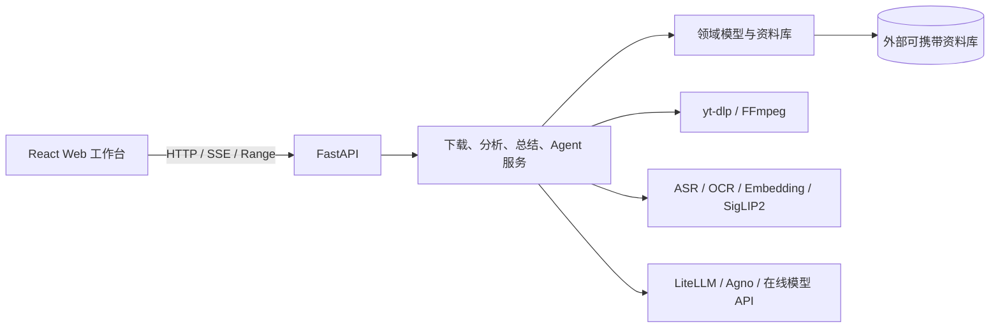

# OpenVideo

本地优先的 AI 视频知识工作台：把视频获取、播放、转写、多模态分析、重点标记、总结编辑和证据问答放进同一个资料库。

OpenVideo 面向课程、技术演示、访谈和长视频学习场景。它不只生成一份脱离原片的摘要，而是让字幕、关键帧、OCR、标记、总结和 AI 回答始终保留时间范围，用户可以随时回到视频核对来源。

> [!IMPORTANT]
> 项目当前版本为 `0.1.0`，处于持续开发阶段，主要面向本机单用户使用，尚未提供可直接安装的桌面发行包。

## 核心能力

| 领域         | 当前能力                                                                                                                         |
| ------------ | -------------------------------------------------------------------------------------------------------------------------------- |
| 视频获取     | 下载 Bilibili、抖音和 YouTube 视频；识别 Bilibili / YouTube 播放列表；支持 `480p`～`2160p` 与最佳质量；最多同时执行 2 个下载任务 |
| 本地导入     | 拖拽导入 AVI、M4V、MKV、MOV、MP4、WebM，原文件不会被修改                                                                         |
| 下载账号     | 通过 OpenVideo 独立浏览器登录、从 Edge / Chrome / Firefox 导入，或手工连接 Cookie；账号密钥写入系统凭据存储                      |
| 可携带资料库 | 创建或打开外部资料库，使用文件夹整理、搜索、移动和删除素材；媒体与用户成果随资料库一起移动                                       |
| 播放与标记   | 本地 Range 流式播放、拖动预览、字幕叠加、时间轴编辑；支持时间点或时间范围标记以及 0～5 级重要程度                                |
| 本地转写     | 优先复用平台字幕，缺失时可使用 Faster Whisper、Qwen3-ASR 或 SenseVoice；模型由设置页下载和管理                                   |
| 多模态分析   | 生成章节、时间轴事件、关键帧、OCR、公式和视觉描述，并构建文本与画面检索索引                                                      |
| 总结工作台   | 按知识笔记、章节整理、复习教练或教程编写预设生成 Markdown 文档树；支持编辑、版本、视频截图 / GIF 配图和 ZIP 导出                 |
| 视频助手     | 提供标记 Agent、总结 Agent 和字幕纠错任务；基于字幕、时间轴、OCR 与画面证据回答，支持当前视频或整个资料库检索                    |
| 运行治理     | AI 修改先形成可审批预览；支持取消、恢复、冲突检测、权限范围和可续传的 SSE 事件流                                                 |

## 使用流程

```text
创建或打开外部资料库
        ↓
粘贴视频地址 / 选择播放列表条目 / 拖入本地视频
        ↓
本地播放与时间轴标记
        ↓
平台字幕或本地 ASR → 章节、关键帧、OCR、公式、视觉索引
        ↓
生成并编辑总结文档
        ↓
围绕当前画面、字幕、标记或总结选区与视频助手协作
```

标记既是播放书签，也是分析提示。重要程度越高，标记附近的内容在分析策略中获得的关注权重越高；AI 给出的时间证据可以直接驱动播放器定位。

## 快速开始

### 环境要求

| 工具             | 要求                                           |
| ---------------- | ---------------------------------------------- |
| Python           | `3.13+`                                        |
| uv               | 用于安装和运行后端依赖                         |
| Node.js          | `22+`                                          |
| pnpm             | `11.19.0`，以根目录 `package.json` 为准        |
| FFmpeg / FFprobe | 下载合并、转码、媒体探测、抽帧和音频提取所必需 |

首次安装后端依赖和本地模型会占用较多磁盘空间；使用 CUDA 模型时还需要兼容的 NVIDIA 驱动与显存。

### 1. 安装依赖

在仓库根目录执行：

```powershell
pnpm install
uv sync --directory apps/backend
```

### 2. 配置 FFmpeg

Windows 开发环境推荐把文件放在：

```text
runtime/tools/ffmpeg/bin/ffmpeg.exe
runtime/tools/ffmpeg/bin/ffprobe.exe
```

也可以加入系统 `PATH`，或在启动前指定完整路径：

```powershell
$env:OPENVIDEO_FFMPEG_PATH = "C:\Tools\ffmpeg\bin\ffmpeg.exe"
$env:OPENVIDEO_FFPROBE_PATH = "C:\Tools\ffmpeg\bin\ffprobe.exe"
```

程序的查找顺序是：单独配置的完整路径 → `OPENVIDEO_TOOLS_DIRECTORY/ffmpeg/bin` → 系统 `PATH`。

### 3. 启动项目

```powershell
pnpm dev
```

Windows 也可以双击或执行：

```powershell
.\run.bat
```

启动后访问：

- Web：<http://127.0.0.1:5173>
- API：<http://127.0.0.1:38471>
- OpenAPI 文档：<http://127.0.0.1:38471/docs>
- 健康检查：<http://127.0.0.1:38471/api/health>

Vite 会把 `/api` 和媒体播放请求代理到 FastAPI。开发日志写入 `runtime/logs/dev/`，每次启动覆盖上一次日志；按 `Ctrl+C` 会同时停止前后端。

### 4. 完成首次设置

1. 在初始化页选择一个项目目录之外的空文件夹来创建资料库，或打开已有资料库。
2. 在“设置”中检查 FFmpeg / FFprobe，选择默认转写模型并按需下载。
3. 如需生成总结、视觉描述或使用视频助手，添加在线 AI 模型并测试能力。
4. 从“下载”页粘贴视频地址，或把本地视频拖入导入区。

基础的资料库管理、下载、播放和本地转写不要求配置在线 AI；总结生成和 Agent 功能需要可用的在线模型。

## AI 与本地模型

OpenVideo 把本地处理和在线推理分开：

- 本地执行：媒体处理、ASR、OCR、公式识别、关键帧提取、文本嵌入、神经重排和 SigLIP2 画面检索。
- 在线执行：大语言模型、视觉语言模型、总结生成和 Agent 工具调用。
- 模型接入：通过 LiteLLM / Agno 适配 OpenAI、Anthropic、Google、DeepSeek、Qwen、xAI、Mistral、OpenRouter 及兼容的 HTTPS API。
- 能力选择：模型会被探测工具调用、流式工具、视觉和上下文容量；Agent 可分别配置快速、复杂和视觉模型角色。

当前不接受 Ollama、LocalAI 等本机 LLM Provider。自定义网关必须使用完整 HTTPS 地址；所有模型至少声明 `text` 输入能力，参与画面分析的模型还需要 `image`。

本地转写方案：

| 引擎           | 特点                                   | 设备约束        |
| -------------- | -------------------------------------- | --------------- |
| Faster Whisper | 多语言，模型档位完整，默认使用 `small` | 支持 CPU / CUDA |
| Qwen3-ASR      | 中文、方言和多语言，使用强制对齐时间戳 | 仅支持 CUDA     |
| SenseVoice     | 低延迟，可保留情绪与声音事件标签       | 支持 CPU 回退   |

模型文件按需下载。国内外模型源会自动测速；高级调试时可用 `OPENVIDEO_MODEL_SOURCE=modelscope` 或 `huggingface` 固定来源。

> [!NOTE]
> 媒体、转写和分析产物默认保存在本地资料库。调用在线模型时，完成任务所需的字幕、文字证据或画面会发送给用户配置的模型服务，请根据素材敏感程度选择供应商。

## 数据目录

OpenVideo 明确区分应用配置、开发运行文件和业务资料库。

```text
%LOCALAPPDATA%/OpenVideo/          # Windows 用户配置目录
├─ preferences.json               # 应用偏好与模型配置
├─ models/                        # ASR、公式与视觉检索模型
├─ retrieval-models/              # 文本嵌入与重排模型
└─ browser-login/                 # OpenVideo 独立登录浏览器数据

OpenVideo/runtime/                 # 项目内可丢弃的开发运行文件
├─ tools/ffmpeg/bin/
└─ logs/dev/

用户选择的资料库/                  # 可携带业务数据，不允许位于项目目录内
├─ library.json
├─ openvideo.sqlite3
├─ agent_checkpoints.sqlite3
├─ assets/
│  └─ <asset-id>/
│     ├─ media/
│     ├─ artifacts/
│     ├─ markers.json
│     └─ meta.json
├─ cache/
└─ temp/
```

应用配置统一位于系统用户配置目录；资料库路径只作为最近打开位置写入偏好。下载账号的非敏感元数据位于配置目录，Cookie 内容由系统凭据存储保存。

更详细的目录说明见 [docs/runtime-directories.md](docs/runtime-directories.md)。

## 配置

推荐优先通过 Web 设置页维护工具目录、模型目录、转写方案、在线模型和 Agent 偏好。部署或固定开发环境时可使用下列环境变量：

| 环境变量                     | 未设置时                          | 用途                                                           |
| ---------------------------- | --------------------------------- | -------------------------------------------------------------- |
| `OPENVIDEO_LIBRARY_PATH`     | 恢复最近资料库或进入初始化页      | 固定外部资料库；设置后禁止在 Web 中切换                        |
| `OPENVIDEO_FFMPEG_PATH`      | 继续查找工具目录和 `PATH`         | FFmpeg 完整路径                                                |
| `OPENVIDEO_FFPROBE_PATH`     | 继续查找工具目录和 `PATH`         | FFprobe 完整路径                                               |
| `OPENVIDEO_TOOLS_DIRECTORY`  | `<项目>/runtime/tools`            | 第三方工具根目录                                               |
| `OPENVIDEO_MODELS_DIRECTORY` | `%LOCALAPPDATA%/OpenVideo/models` | ASR、公式和视觉模型根目录                                      |
| `OPENVIDEO_DOWNLOAD_PROXY`   | 空                                | YouTube 下载使用的 HTTP、HTTPS 或 SOCKS 代理；国内平台保持直连 |
| `OPENVIDEO_AI_MODELS`        | 使用设置页保存值                  | LiteLLM 在线模型配置 JSON；设置后模型列表由环境托管            |
| `OPENVIDEO_CORS_ORIGINS`     | 两个本机 Vite 来源                | 允许访问 API 的来源，多个值用逗号分隔                          |
| `OPENVIDEO_MODEL_SOURCE`     | 自动选择                          | 固定为 `modelscope` 或 `huggingface`                           |
| `VITE_API_BASE_URL`          | 空，使用 Vite 代理                | Web 直接访问的 API 根地址                                      |

[`.env.example`](.env.example) 提供常用变量模板。`pnpm dev` 会继承当前终端环境；后端不会自动读取仓库根目录的 `.env`，因此后端变量应在启动命令所在的终端或系统环境中设置。

## 架构



主要技术栈：

- Web：React、TypeScript、Vite、React Router、TanStack Query、shadcn/ui、Radix UI、Vidstack、Milkdown、Storybook、Vitest。
- API：Python、FastAPI、Pydantic、SQLite、yt-dlp、FFmpeg、Agno、LiteLLM。
- 本地 AI：faster-whisper、Qwen3-ASR、SenseVoice、RapidOCR / PaddleOCR、Transformers、PyTorch、ONNX Runtime。

仓库结构：

```text
OpenVideo/
├─ apps/
│  ├─ backend/
│  │  ├─ src/openvideo/
│  │  │  ├─ core/             # 领域模型、资料库、索引与持久化契约
│  │  │  ├─ llm/              # 在线模型能力、调度与 Agno 适配
│  │  │  ├─ tools/            # 下载、媒体、转写、OCR 与视觉处理
│  │  │  └─ ui/               # FastAPI 路由与事件流
│  │  └─ tests/
│  └─ web/
│     └─ src/
│        ├─ app/               # 路由、全局状态与应用框架
│        ├─ components/        # 通用组件与 Agent UI
│        ├─ features/          # 下载、资料库、播放器、标记、总结、设置
│        ├─ pages/
│        └─ shared/            # 类型、API 客户端与共享逻辑
├─ docs/
│  └─ adr/                     # 已接受的架构决策
├─ scripts/                    # 开发与 Storybook 启动脚本
└─ runtime/                    # Git 忽略的工具与开发日志
```

## 开发命令

在仓库根目录执行：

| 命令                    | 用途                          |
| ----------------------- | ----------------------------- |
| `pnpm dev`              | 同时启动 FastAPI 与 Vite      |
| `pnpm lint:backend`     | Ruff 检查后端                 |
| `pnpm test:backend`     | 运行后端 Pytest               |
| `pnpm format:check:web` | 检查前端格式                  |
| `pnpm lint:web`         | ESLint 检查前端               |
| `pnpm check:web`        | TypeScript 类型检查           |
| `pnpm test:web`         | 运行前端单元测试              |
| `pnpm test:storybook`   | 在浏览器中运行 Storybook 测试 |
| `pnpm build:web`        | 构建 Web                      |
| `pnpm storybook:web`    | 启动 Storybook                |
| `pnpm build:storybook`  | 构建静态 Storybook            |

推荐的完整校验顺序：

```powershell
pnpm lint:backend
pnpm test:backend
pnpm format:check:web
pnpm lint:web
pnpm check:web
pnpm test:web
pnpm test:storybook
pnpm build:web
```

## 当前边界

- 当前是绑定 `127.0.0.1` 的本地 Web 应用，不是多用户服务。
- 平台下载能力依赖 yt-dlp 和平台当前规则；账号连接不代表可以绕过付费、地区、DRM 或其他访问限制。
- 不处理直播、DRM、弹幕和评论；Bilibili 播放列表与合集、YouTube 播放列表的具体可见内容取决于平台返回结果。
- AI 总结与回答可能出错。时间戳、字幕和画面引用用于帮助核对，不应被视为事实保证。
- 本地模型首次下载和建立索引可能耗时较长；Qwen3-ASR、视觉索引和神经重排对内存或显存要求较高。

## 设计文档

- [架构决策记录](docs/adr/README.md)
- [本地运行与模型目录](docs/runtime-directories.md)
- [OpenBrief 技术架构参考](docs/openbrief-%E6%8A%80%E6%9C%AF%E6%9E%B6%E6%9E%84%E8%AF%A6%E8%A7%A3.md)
